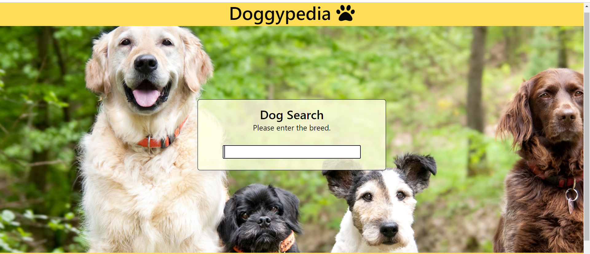

# Doggypedia

While we all fight a global pandemic together, the quarentines, sheltering in place, and social distancing has left many people missing the companionship and comradery that we typically enjoy in a COVID free world. While it may be challenging to see your best friends during these unprecidented times, it shouldn't be that hard to learn more about man's best friend. You may have more time on your hands while sheltering in place and in quarentine, but why spend that time visiting various informational websites when you could better spend that time playing with your new furry friend. 

Doggypedia aggregates informaiton on a wide variety of dog breeds in one place with a convenient user interface to better facilitate your search for a new companion. Doggypedia places videos and breed information all within one click based on whatever breed you have an interest in.

__Built With__
* HTML
* CSS
* Javascript
* Jquery
* Bumla.io

__API(s)__ 
* The Dog Api https://api.thedogapi.com/v1/breeds
* Wikipedia Api https://en.wikipedia.org/w
* Youtube Data Api V3 https://developers.google.com/youtube/v3

 __Features__
 * Compatible with multiple browsers
   * Google Chrome
   * Safari 
 * Compatible with mobile users
 * Large selection of dog breeds

__Live URL__
https://kray306090.github.io/yorkie-terrier/

__Images__

__Future Development to come__
* Integration with dog adoption agencies to connect you with a dog in your area to fully complete your search
* Expandion to include Kittypedia
